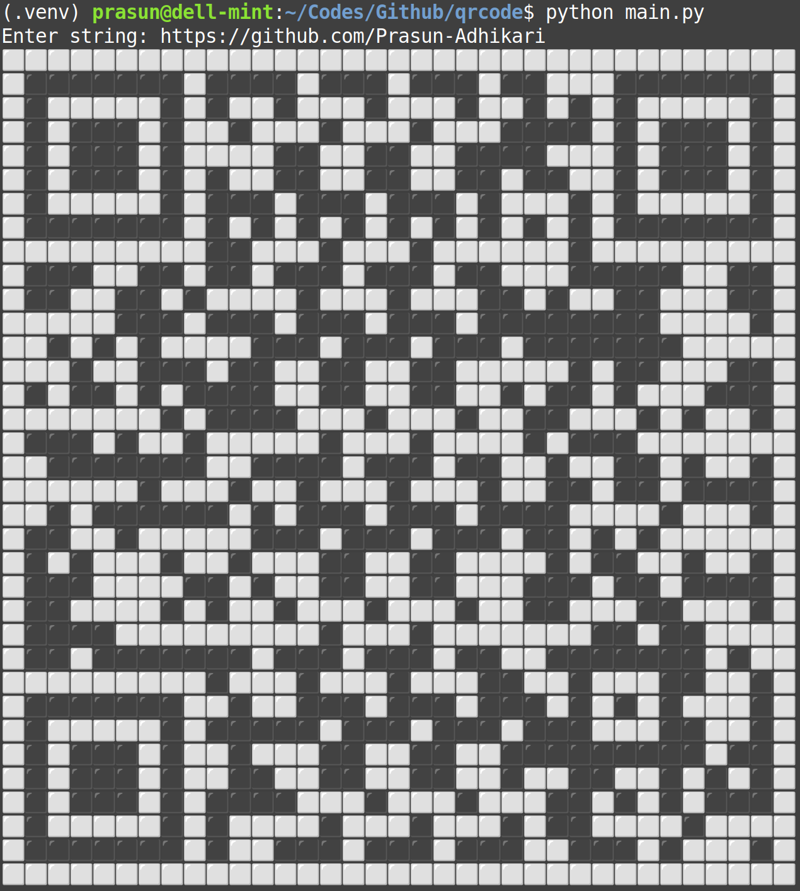

# QR Code Generator

Basic code to generate qr code from text and print it to the terminal.
Currently, it is hard-coded to generate a version 4 qr code with Low correction level.
This means a 33x33 grid with support for 80 characters (byte encoding).

## Sample output

#### Code was written with help from
- [https://codingchallenges.fyi/challenges/challenge-qr-generator]
- [https://www.thonky.com/qr-code-tutorial/]
- [https://en.wikipedia.org/wiki/QR_code]

